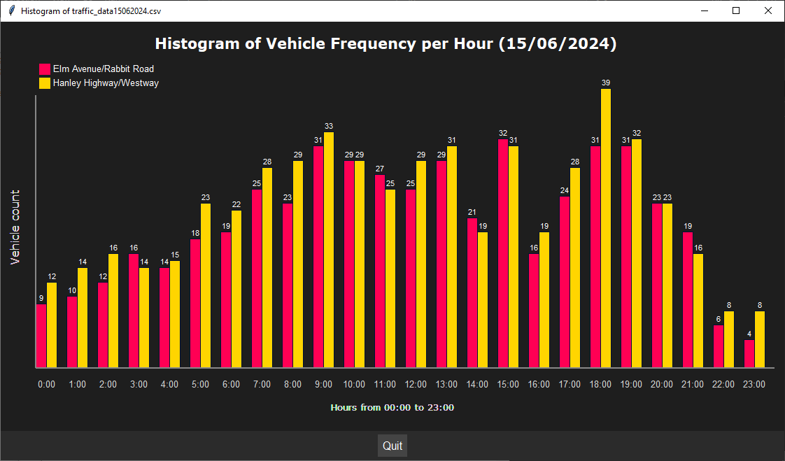
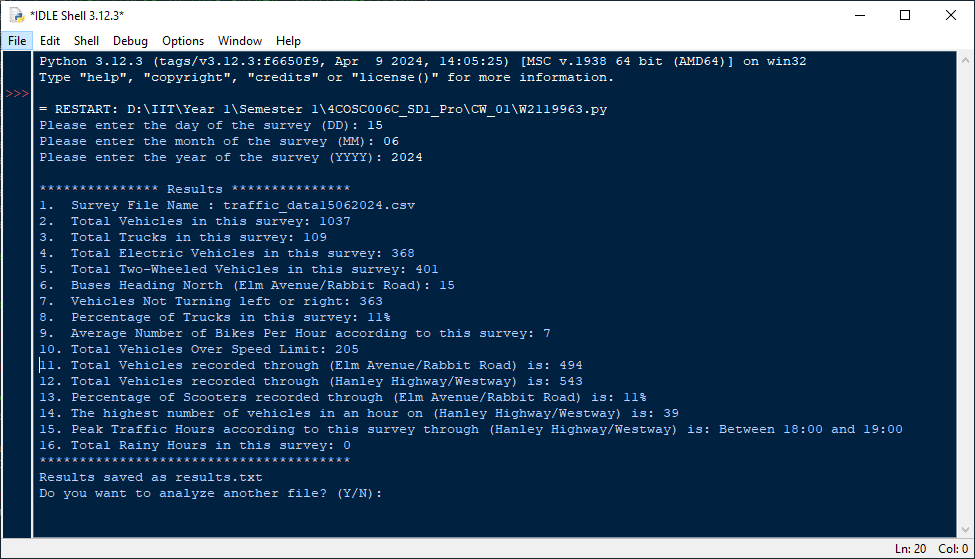
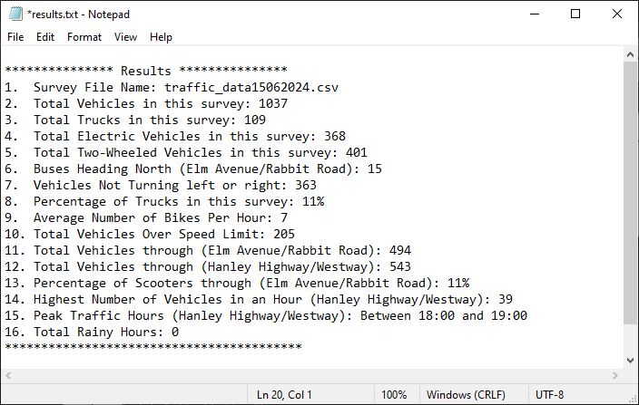

# Traffic Analyzer

A Python-based application designed to process and visualize traffic survey data from CSV files. It provides detailed analysis and graphical histograms to help users understand vehicle flow patterns and key traffic metrics.

## 🔢 Features

- **Traffic Data Analysis**: 
  - Analyze traffic survey data to extract insights like:
    - Total vehicles
    - Truck counts
    - Electric vehicle usage
    - Two-wheeled vehicles (bicycles, motorcycles, scooters)
    - Peak traffic hours
    - Speeding violations
    - Weather impact on traffic
- **Histogram Visualization**:
  - Visualize vehicle frequency per hour at junctions:
    - **Elm Avenue/Rabbit Road**
    - **Hanley Highway/Westway**
- **CSV File Management**:
  - Validates user input for survey date and loads corresponding CSV files.
  - Saves results in a user-friendly text format (`results.txt`).
- **Interactive User Experience**:
  - Offers options to analyze additional files.
  - Handles invalid input gracefully.
  - Provides a responsive graphical interface using `tkinter`.

---

## 💻 Technologies Used

- **Python 3.1+** – core programming language
- **tkinter** – graphical user interface
- **csv** – data handling and processing

---

## 🖼️ Previews
<div align="center" style="display: flex; flex-wrap: wrap; gap: 20px; justify-content: center; margin: 20px 0;">
  <div style="flex: 1 1 30%; min-width: 250px; text-align: center;">
    
    <p style="margin-top: 8px; color: #666;">Traffic distribution histogram</p>
  </div>
  <div style="flex: 1 1 30%; min-width: 250px; text-align: center;">
    
    <p style="margin-top: 8px; color: #666;">Interactive terminal interface</p>
  </div>
  <div style="flex: 1 1 30%; min-width: 250px; text-align: center;">
    
    <p style="margin-top: 8px; color: #666;">Save generated output</p>
  </div>
</div>


---

## 🚀 Getting Started

To run this project locally:

1. **Clone the repository**

   ```bash
   git clone https://github.com/Anuja-jayasinghe/traffic_analyzer.git
   cd traffic_analyzer

# Run the application
    ```bash
    python traffic_analyzer.py

# Then follow the prompts to input your desired date for analysis
